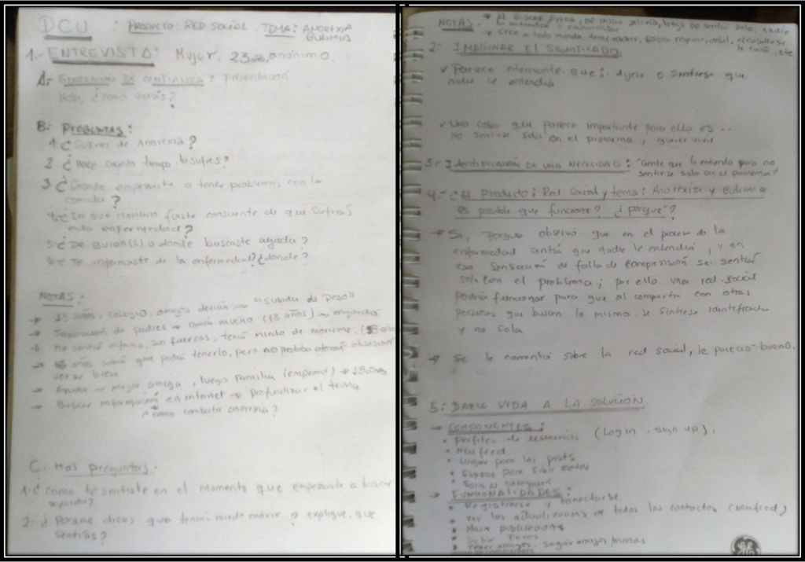
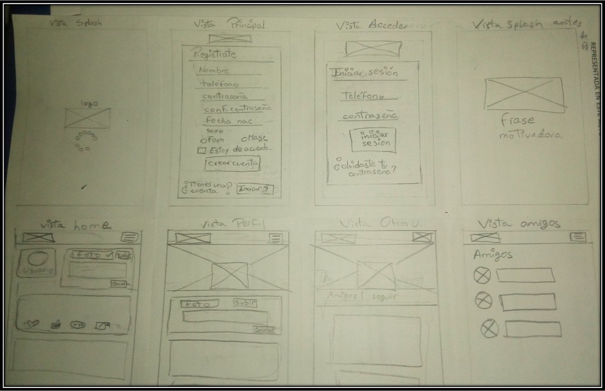
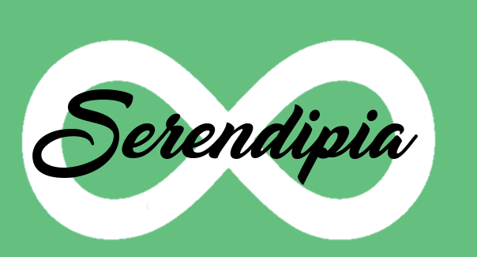
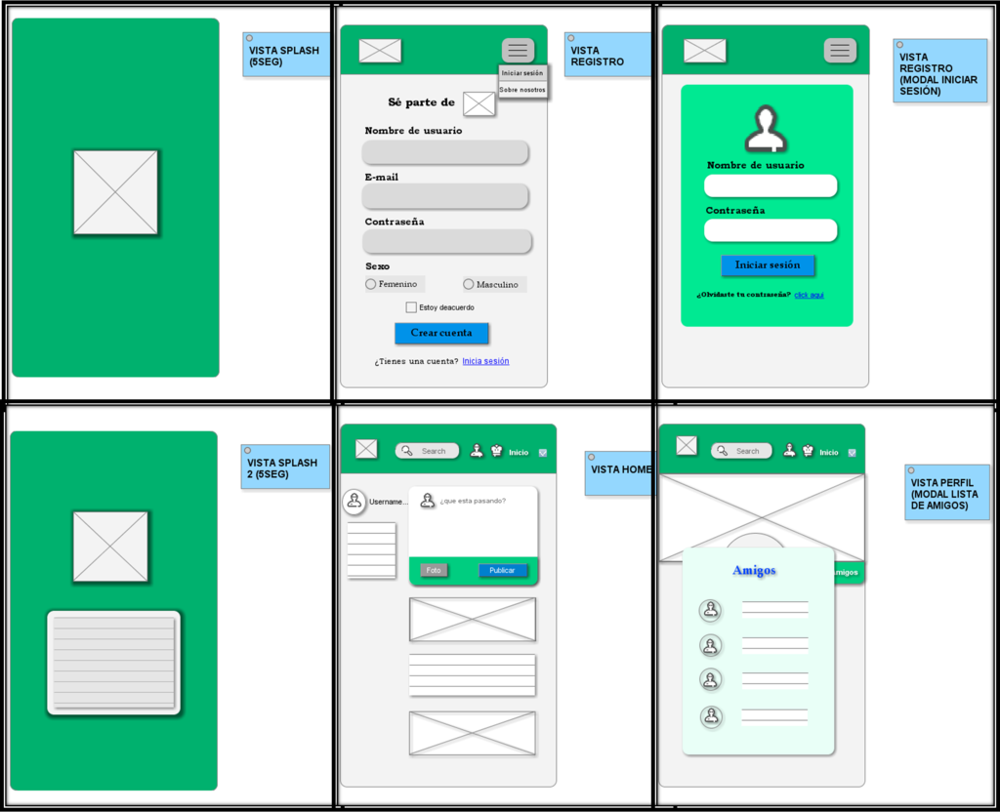
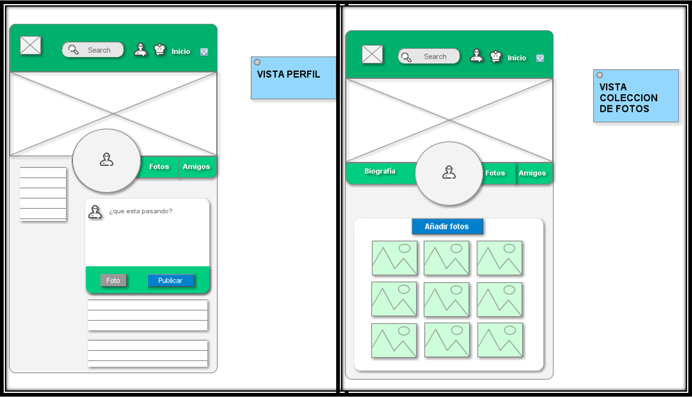

# Red social: "SERENDIPIA"

* **Track:** _Common Core_
* **Curso:** _Crea tu propia red social_
* **Unidad 5:** _Crea tu propia red social_

***

## Objetivo:

Crear una Red Social que cumpla con las expectativas de un emprendedor muy visionario y de los usuarios que la usarán, teniendo  en cuenta lo que necesitan ellos al momento de crear este producto.

***

## Requisitos mínimos:

* Perfiles de usuarios

* Un newsfeed donde puedes ver las actualizaciones de todos tus  contactos

* Un lugar donde poder escribir posts

* Un lugar para subir fotos

* Capacidad para poder tener amigos o para poder seguir a personas/marcas dentro de la red social

* Ser mobile friendly

***

## PARTICIPANTES:

* MarÍa Cristina Ortiz Villafuerte.

* Yosseline Gabriela Apcho Huaman.

***

## PROCESO:

# Planificación:

* Usamos la herramienta 'Trello':

link : https://trello.com/b/CARQ3tbT/red-social-anorexia-y-bulimia

# Etapas DCU:

1. Descubrimiento e investigación: Proponer ideas

Los temas propuestos fueron:

* Ideas Yosseline:

Red social anti Anorexia y Bulimia.
Red social sobre egresadas de laboratoria.
Red social de Roleplayers.
Red social de fans de Gravity Falls.

* Ideas María Cristina:

Red social sobre mujeres empoderadas.
Red social de músicos prometedores.
Red social sobre la depresión.
Red social sobre escritores y lectores.

2. Síntesis y definición: Elección del tema

* Tema: Red social anti Anorexia y Bulimia

* Porque se eligío?

* Puesto que hay tantos sitios web en el cuál te enseñan a caer en ese mundo, haciéndote creer que mientras más delgada eres, más perfecta estás; pero que se sepa no hay un sitio o web-app o lo que sea donde aquellas personas que sufrieron de esos problemas cuenten sus casos y suban fotos de sus antes y después, de sus mejoras, tips para superar a Ana y Mía.
Es un problema social que ha existido siempre influenciado por el arquetipo de chica perfecta, y se ha dejado de lado la parte interior de una persona, que vale por lo que es y no como se ve.

* La elección de este tema fue por decisión unánime. Basándonos más en el hecho de querer hacer una labor social con las herramientas que hemos aprendido hasta el momento.

3. Descubrimiento e investigación:

* Se entrevistó a algunos usuarios para saber si les agradaba la idea de la Red social anti Ana y Mía.

4. Ideación:

Para comenzar, cada una hizo su propio sketch, en el cuál plasmamos nuestras ideas.

**Sketch Yosseline**

**Sketch Maria Cristina**

Por último, analizamos ambos sketchs y decidimos unir las mejores ideas:

- 1era vista: "vista splash(5 seg)" ( logo).

- 2da vista: " registro", barra de navegacion(Maria Cristina): Menu hamburguesa(iniciar sesión, "sobre nosotros"), formulario de registro(Yoss, cambiar registrate por "sé parte de (logo)" de MC)(no se considera el número de teléfono), vista modal de inicio de sesion(Maria cristina, pero en español).

- 3era vista : "vista splash 2 (5 seg)" logo con frases motivadoras(6 inicialmente)

- 4ta vista: "vista home, inicio" , queda el de Yoss, barra de navegación(María Cristina): orden (izquierda-derecha):Logo, input search, usuario(con icono), alertas(icono campana), inicio, (icono select donde va: salir o cerrar sesión)

- 5ta vista: "vista perfil", queda de María Cristina(quitar boton seguir), agregando la parte de subir foto en el post (Yoss), vista modal de lista de amigos( Yoss).

- 6ta vista: "vista fotos", queda de María Cristina.

5.  IDEACIÓN: Componentes finales: (Definición de logo, colores, etc)

* Se eligió el nombre: Serendipia. Cuyo significado es 'descubrimiento historiologicamente hablando o un hallazgo afortunado, valioso e inesperado que se produce de manera accidental o causal, o cuando se está buscando una cosa distinta.'

* Se eligió el siguiente logo:

* Se eligió los colores: verde(mayoría) acompañado de azul y un gris de tono suave; todas las barras de navegación verde, los iconos de color gris , los botones azules y otros verdes, el fondo un gradiente de gris bajo, y blanco para otros fondos.

* Se eligieron las frases motivadora para la segunda vista splash:

- "Necesito estar mas delgado(a) (tachado) Amarme a mi mismo"

- "Limpia tu mente del, NO PUEDO!".

- "Como tú , no hay nadie".

- "Aceptarse a si mismo es el comienzo de una aventura que dura toda la vida".

- "Nacimos para ser felices., no para ser perfectos".

- " cuando cambias el chip del " quiero estar delgado(a)" a "quiero estar sano" todo fluye..."

6. Prototipo:

7. Testeo con usuarios: Producto final

* Se testeó con los mismos usuarios(2), quedo el prototipo e hubo un cambio:
en la vista de registro, recomiendan colocar una imagen de fondo algo opaco.

***

## Herramientas utilizadas:

- jQuery.

- Materialize

- HTML5.

- etc..
